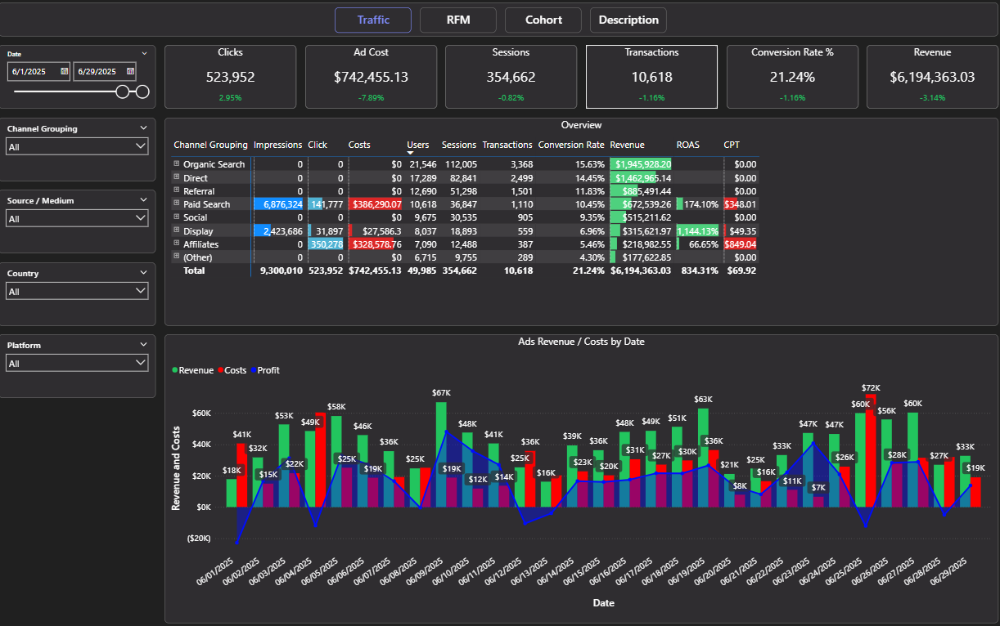
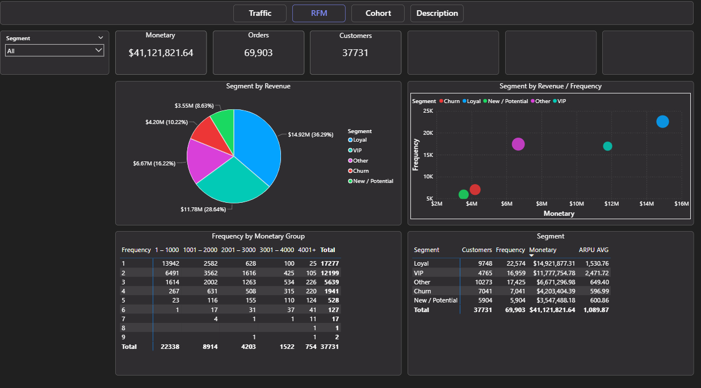

# Power BI Analytics Dashboard

A comprehensive dashboard for web analytics, customer segmentation, and cohort analysis. Dashboard provides insights into traffic sources, customer behavior, marketing ROI, and user retention patterns.

## 📊 Dashboard Overview

This Power BI dashboard consists of three main analytical sheets designed for comprehensive business intelligence:

1. **Traffic** - Traffic source analysis and marketing performance
2. **RFM** - Customer segmentation based on Recency, Frequency, and Monetary value
3. **Cohort** - User behavior analysis over time

---

## 🚦 Traffic Dashboard

### Report Purpose
This dashboard provides a comprehensive overview of traffic sources, advertising spend, and channel effectiveness. It helps identify the most profitable traffic sources and optimize marketing budgets.

### What the Report Shows:

**Key Metrics (KPIs):**
- Click volume and advertising costs for the selected period
- User activity metrics (sessions and transactions)
- Conversion rate and total revenue

**Channel Analysis:**
The "Overview" table breaks down metrics by channel groups (Organic Search, Paid Search, Display, etc.):
- **Traffic Volume:** Impressions and clicks per channel
- **Advertising Costs:** Spending on paid channels
- **Engagement:** Users and sessions
- **Performance:** Transactions, conversion rate, revenue
- **ROI Metrics:** ROAS (Return On Ad Spend) and CPT (Cost Per Transaction) for paid channels

**Revenue and Cost Trends:**
The chart displays daily revenue and advertising costs, helping identify trends and high-performing periods.

**Filtering:**
Use filters on the left to analyze by date, channels, sources, countries, and platforms.

### How to Use:
Use this dashboard to assess channel performance, optimize advertising spend, and identify the most profitable traffic sources.



---

## 👥 RFM Dashboard

### Report Purpose
RFM analysis segments customers by Recency, Frequency, and Monetary value. It helps identify the most valuable customers, define groups for targeted marketing campaigns, and understand the customer lifecycle.

### What the Report Shows:

**Key Metrics (KPIs):**
- Total monetary value across all customers (Monetary)
- Number of transactions (Orders) and unique customers (Customers)
- Ability to filter by segment for detailed analysis

**Visualizations:**
- **Pie Chart "Segment by Revenue"** - Shows each segment's contribution to total revenue (Loyal, VIP, Churn, etc.)
- **Bubble Chart** - Illustrates the relationship between revenue and purchase frequency by segment
- **Segment Table** - Detailed metrics per segment: customer count, transactions, revenue, and Average Revenue Per User (ARPU)
- **Frequency by Monetary Group Matrix** - Distribution of customers by purchase frequency and amount

### How to Use:
Use this dashboard to:
- Identify VIP and Loyal customers for personalized offers
- Detect at-risk customers (Churn) for retention programs
- Encourage repeat purchases among low-frequency customers
- Optimize marketing budgets by focusing on the most valuable segments



---

## 📈 Cohort Dashboard

### Report Purpose
This dashboard analyzes user behavior by cohort: grouping users by their first activity month (first transaction or first session) and evaluating their activity, purchases, and revenue over time.

### What the Report Shows:

**1. Cohort by Transaction Quantity:**
- **Rows:** Month of user's first transaction
- **Columns:** Subsequent months (Month 0 is the first transaction month, Month 1, Month 2, etc.)
- **Values:** Total number of transactions made by the cohort in each month
- **Objective:** Track repeat purchase frequency and activity trends by cohort

**2. Cohort by Revenue:**
- **Rows:** Month of user's first transaction
- **Columns:** Subsequent months after the first transaction
- **Values:** Total revenue generated by the cohort in each month
- **Objective:** Assess monetary value of cohorts and revenue distribution over time

**3. Cohort by Retention Rate:**
- **Rows:** Month of user's first session
- **Columns:** Subsequent months after the first session
- **Values:** Percentage of users from the cohort who returned in each month
- **Objective:** Measure retention and identify user retention issues

**Filters:**
Available filters include first transaction/session date, acquisition channels, traffic sources, countries, and platforms for detailed analysis of specific segments.

### How to Use:
Use this dashboard to:
- Evaluate long-term customer value across different cohorts
- Assess marketing campaign effectiveness over time
- Identify retention issues and develop improvement strategies
- Compare performance of different cohorts over time


---

## 📁 Data Structure

The dashboard uses four main data tables:

### 1. Marketing (`marketing.csv`)
Aggregated daily marketing data by traffic source:
- `date` - Date of the record
- `source_medium` - Traffic source and medium (e.g., "google/cpc")
- `channel_grouping` - Channel category (Organic Search, Paid Search, etc.)
- `country` - User country
- `platform` - Device platform (Desktop, Mobile, Tablet)
- `impressions` - Ad impressions (for paid channels)
- `clicks` - Number of clicks
- `cost` - Advertising costs

### 2. Sessions (`sessions.csv`)
User session data:
- `date` - Session date
- `user_id` - Unique user identifier
- `session_id` - Unique session identifier
- `source_medium` - Traffic source and medium
- `channel_grouping` - Channel category
- `country` - User country
- `platform` - Device platform

### 3. Transactions (`transactions.csv`)
Transaction records linked to sessions:
- `date` - Transaction date
- `user_id` - User identifier
- `session_id` - Associated session ID
- `transaction_id` - Unique transaction identifier
- `source_medium` - Traffic source and medium
- `channel_grouping` - Channel category
- `country` - User country
- `platform` - Device platform

### 4. Products (`products.csv`)
Product details for each transaction:
- `transaction_id` - Associated transaction ID
- `product_id` - Unique product identifier
- `product_name` - Product name
- `product_category` - Product category
- `product_cost` - Product price (revenue)

---

## 🔧 Data Generation

To generate mock data for the dashboard, use the provided Python script:

```bash
python generate_mock_data.py --start-date 2025-01-01 --months 6
```

### Script Options:
- `--start-date` - Start date in YYYY-MM-DD format (default: 2025-01-01)
- `--months` - Number of months to generate (default: 6)
- `--output-dir` - Output directory for CSV files (default: ./data)
- `--users` - Number of unique users in pool (default: 50000)

### Example:
```bash
# Generate 6 months of data starting from January 2025
python generate_mock_data.py --start-date 2025-01-01 --months 6

# Generate 12 months of data starting from January 2024
python generate_mock_data.py --start-date 2024-01-01 --months 12
```

---

## 📊 Power BI Setup

### Requirements:
- Power BI Desktop (latest version recommended)
- Python script for data generation (Python 3.7+)

### Import Steps:
1. Generate CSV files using the Python script
2. Open Power BI Desktop
3. Import data from CSV files:
   - Marketing data: `marketing.csv`
   - Sessions data: `sessions.csv`
   - Transactions data: `transactions.csv`
   - Products data: `products.csv`

### Relationships:
Create the following relationships in Power BI:
- `transactions` ↔ `sessions`: `session_id`, `user_id`
- `transactions` ↔ `products`: `transaction_id`
- `marketing` ↔ `sessions`: `date`, `source_medium`, `channel_grouping`, `country`, `platform`
- `marketing` ↔ `transactions`: `date`, `source_medium`, `channel_grouping`, `country`, `platform`

---

## 📝 Features

### Traffic Dashboard:
- ✅ Real-time KPI tracking
- ✅ Multi-channel performance comparison
- ✅ ROAS and CPT calculations
- ✅ Daily revenue and cost trends
- ✅ Advanced filtering capabilities

### RFM Dashboard:
- ✅ Automated customer segmentation
- ✅ ARPU calculations per segment
- ✅ Frequency and monetary value matrices
- ✅ Visual segment analysis
- ✅ Churn risk identification

### Cohort Dashboard:
- ✅ Transaction cohort analysis
- ✅ Revenue cohort tracking
- ✅ Retention rate visualization
- ✅ Month-over-month comparisons
- ✅ Multi-dimensional filtering

---

## 🎯 Use Cases

- **Marketing Teams:** Optimize ad spend and channel allocation
- **Product Teams:** Understand user behavior and retention patterns
- **Business Analysts:** Track KPIs and identify trends
- **Management:** Evaluate ROI and customer lifetime value

---

## 📦 File Structure
